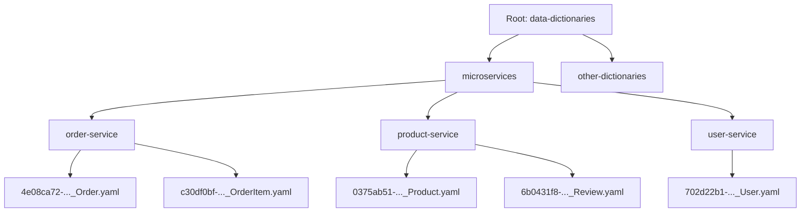

# Migration Plan: Flat to Hierarchical Data Dictionaries

## 1. Migration Plan

### A. Overview

- **Old Model:** Entities stored in a flat structure, typically as YAML files with simple names, no UUIDs, and no package/microservice grouping.
- **New Model:** Entities are grouped by microservice (package), each entity file is named with a UUID and entity name, and the directory structure is hierarchical.

**Example:**

```
Old: data-dictionaries/Order.yaml
New: data-dictionaries/microservices/order-service/4e08ca72-..._Order.yaml
```

### B. Migration Steps

1. **Backup** all existing data dictionaries.
2. **Run migration script** (`backend/src/utils/migration.ts`):
   - Adds UUIDs to entities if missing.
   - Renames files to `{uuid}_{EntityName}.yaml`.
   - Moves files into `microservices/{service}/` directories.
   - Removes old files after migration.
3. **Verify** migrated data:
   - Check that all entities are present in the new structure.
   - Confirm UUIDs and correct file naming.
4. **Update integrations**:
   - Update any scripts, tools, or code that reference the old flat structure to use the new hierarchical paths.
5. **Test** using the new API endpoints and frontend UI.

### C. Rollback Plan

- Restore from backup if any issues are encountered during migration.

---

## 2. Documentation Update Plan

### A. New Model Overview

- **Packages (Microservices):** Top-level grouping for related entities.
- **Entities:** Defined within packages, each with a unique UUID.
- **Attributes & Relationships:** Remain as before, but now scoped within packages.

#### Mermaid Diagram: Hierarchical Structure



### B. Organizing Packages and Entities

- **Create a new package:** Add a new directory under `microservices/` for each microservice or logical grouping.
- **Add entities:** Place entity YAML files (with UUIDs) inside the appropriate package directory.
- **Naming convention:** `{uuid}_{EntityName}.yaml`

### C. Using the New Features

#### API Endpoints

- **List all services:** `GET /api/services`
- **List entities in a service:** `GET /api/services/{service}/entities`
- **Get entity schema:** `GET /api/services/{service}/entities/{entity}`
- **Create entity:** `POST /api/services/{service}/entities`
- **Update entity:** `PUT /api/services/{service}/entities/{entity}`
- **Delete entity:** `DELETE /api/services/{service}/entities/{entity}`
- **Package hierarchy:** `GET /api/packages/hierarchy/{rootPackage}`

#### Frontend UI

- **Services view:** Navigate by package/microservice.
- **Entities view:** Shows entities grouped by package.
- **Visualization:** Diagrams reflect hierarchical organization.
- **Search:** Search across all packages and entities.

### D. Migration Guide Section

- Add a new section to the user guide:
  - Explains the migration process.
  - Details backup, running the migration script, and verification.
  - Provides troubleshooting tips.

---

## 3. Documentation File Updates

- **docs/user-guide.md**: Add sections on the new model, organizing packages/entities, using the new UI, and migration guide.
- **docs/api-reference.md**: Update with new endpoints for packages and services.
- **README.md**: Add a summary of the new hierarchical model and migration instructions.

---

## 4. Next Steps

- Update documentation files as outlined above.
- Communicate the migration plan to all stakeholders.
- Schedule and execute the migration.